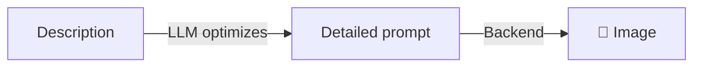

# ArtistAgent

Agent specialized in **generating and editing images** with prompts optimized by LLM.

## How it works



`ArtistAgent` uses LLM to transform simple descriptions into detailed, optimized prompts before generating the image.

## Usage

```python
from omniachain import ArtistAgent, OpenAI, Google

# With DALL-E 3
artist = ArtistAgent(provider=OpenAI(), image_backend="openai")

# With Google Nano Banana
artist = ArtistAgent(provider=Google(), image_backend="google")

# With local Stable Diffusion
artist = ArtistAgent(provider=OpenAI(), image_backend="comfyui")
```

## Generate Image

```python
# LLM optimizes the prompt automatically
await artist.create("Logo for my coffee shop", "logo.png")

# No optimization (direct prompt)
await artist.create(
    "A minimalist logo for a coffee shop, flat design, warm tones",
    "logo.png",
    optimize_prompt=False,
)
```

## Variations

```python
paths = await artist.create_variations(
    "Portrait of cat with glasses",
    output_dir="./cats",
    n=4,
)
# → cats/image_1.png, image_2.png, image_3.png, image_4.png
```

## Edit Images

```python
await artist.edit_image(
    "photo.png",
    "Change the background to a beach at sunset",
    output_path="foto_praia.png",
)
```

## Parameters

| Stop | Type | Default | Description |
|-------|------|---------|-----------|
| `provider` | `BaseProvider` | — | Provider LLM |
| `image_backend` | `str` | `"auto"` | Generation backend |
| `tools` | `list[Tool]` | `[]` | Extra tools |
| `system_prompt` | `str` | — | System prompt |

!!! info "Prompt Optimization"
    When `optimize_prompt=True` (default), the agent uses LLM to create optimized English prompts for the backend, including details of style, lighting, composition, and artistic technique.