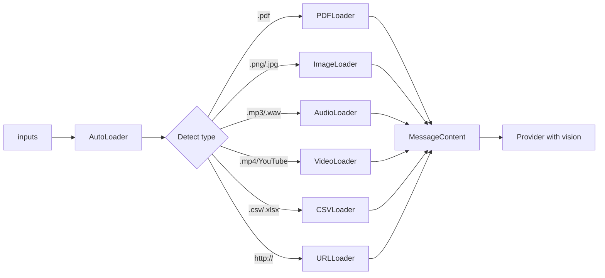

# Multimodal Agent

Processes **any type of input**: text, PDF, image, audio, video, CSV, URL.

## Usage

```python
from omniachain import MultimodalAgent, OpenAI

agent = MultimodalAgent(provider=OpenAI("gpt-4o"))

result = await agent.run(
    "Analyze all this data and generate an executive summary",
    inputs=[
        "relatorio.pdf", # PDF → extracted text
        "grafico_vendas.png", # Image → base64 (view)
        "data.csv", # CSV → table + statistics
        "intervista.mp3", # Audio → Whisper transcription
        "presentacao.mp4", # Video → frames + audio
        "https://example.com", # URL → scraping
    ],
)
```

## How it works internally



## Supported Types

| Extension | Loader | What does it do |
|----------|-----------|-----------|
| `.pdf` | PDFLoader | Extract text with PyPDF |
| `.png/.jpg/.webp` | ImageLoader | Base64 for native view |
| `.mp3/.wav/.ogg` | AudioLoader | Transcribe with Whisper |
| `.mp4/.avi/.mkv` | VideoLoader | **Frames + transcription** |
| `.csv/.xlsx` | CSVLoader | Pandas: data + statistics |
| `.py/.js/.ts` | CodeLoader | Code with info syntax |
| `http://...` | URLLoader | Scraping with BeautifulSoup |
| YouTube URL | VideoLoader | Download + frames + audio |

## Video: 3 Layers

`VideoLoader` is unique — no framework does this:

1. **📸 Keyframes**: Extracts N distributed frames → base64 → model sees
2. **🎵 Audio**: Extract track → Whisper transcription
3. **📊 Metadata**: Duration, resolution, codec, FPS

```python
from omniachain.loaders.video import VideoLoader

loader = VideoLoader(num_frames=6, transcribe_audio=True)
contents = await loader.load("video.mp4")
# → [summary, frame1, frame2, ..., frame6, transcript]
```

!!! warning "Requirement"
    VideoLoader and AudioLoader need **ffmpeg** installed on the system.