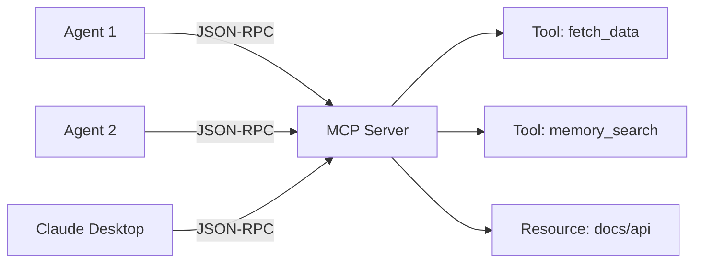

# MCP — Model Context Protocol

OmniaChain has **native** support for Anthropic's MCP — server, client and transports.

## What is MCP?

MCP is a standardized protocol for exposing tools, resources and prompts via JSON-RPC. Allows **any agent** to access tools from **any server**.

## When to use

| Scenario | Solution |
|---------|---------|
| Tools in the same process | `@tool` decorator |
| Tools shared between agents | **MCP Server** |
| Connect with Claude Desktop | **MCP Server (stdio)** |
| Access external server tools | **MCP Client** |

!!! type "Next"
    - [Create MCP Server](server.md)
    - [Use MCP Client](client.md)