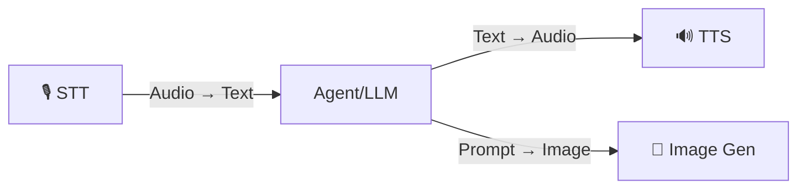

# Media: STT, TTS & Images

OmniaChain offers **3 media services** with pluggable backends — paid APIs and 100% free/local alternatives.

## Overview



| Service | Class | Built-in Backends |
|---------|--------|-------------------|
| **Speech-to-Text** | `SpeechToText` | `openai`, `whisper-local`, `faster-whisper`, `google` |
| **Text-to-Speech** | `TextToSpeech` | `openai`, `edge` ⭐, `coqui`, `google` |
| **Image Generation** | `ImageGenerator` | `openai`, `google`/`nano-banana`, `stability`, `comfyui` |

!!! tip "Free"
    - **Edge TTS** — free TTS from Microsoft, no API key, high quality PT-BR voices
    - **Local Whisper** — STT running 100% offline
    - **ComfyUI** — Local Stable Diffusion, free of charge

## Quick Start

```python
from omniachain import SpeechToText, TextToSpeech, ImageGenerator

# STT — Transcribe audio
stt = SpeechToText(backend="auto")
text = await stt.transcribe("audio.mp3")

# TTS — Synthesize voice (Edge TTS = free)
tts = TextToSpeech(backend="edge", voice="pt-BR-AntonioNeural")
await tts.speak_to_file("Hello world!", "saida.mp3")

# Generate Image (DALL-E, Nano Banana, etc.)
gen = ImageGenerator(backend="openai")
await gen.generate_to_file("An astronaut cat", "gato.png")
```

## Custom Backend

Plug **any API** into 3 lines:

```python
from omniachain.media.image_gen import ImageBackend, ImageGenerator

class MidjourneyBackend(ImageBackend):
    async def generate(self, prompt, size="1024x1024", n=1, **kw):
        # call your API here
        return [image_bytes]

ImageGenerator.register_backend("midjourney", MidjourneyBackend)
gen = ImageGenerator(backend="midjourney")
```

The same pattern works for `STTBackend` and `TTSBackend`.

## Specialized Agents

| Agent | Class | What does it do |
|--------|--------|-----------|
| **VoiceAgent** | `VoiceAgent` | STT → LLM → TTS (voice chat) |
| **ArtistAgent** | `ArtistAgent` | Generates images with LLM-optimized prompts |

```python
from omniachain import VoiceAgent, ArtistAgent, OpenAI

# Voice agent
voice = VoiceAgent(provider=OpenAI(), tts_backend="edge")
audio = await voice.listen_and_respond("question.mp3")
await voice.chat() # Interactive mode in terminal

# Artist agent
artist = ArtistAgent(provider=OpenAI(), image_backend="openai")
await artist.create("Logo for minimalist cafe", "logo.png")
```

##Tools

Any agent can use the media tools:

```python
from omniachain import Agent, Groq, speech_to_text, text_to_speech, generate_image

agent = Agent(
    provider=Groq(),
    tools=[speech_to_text, text_to_speech, generate_image],
)

result = await agent.run("Transcribe the audio.mp3 file and then read the text aloud")
```

---

!!! info "Next"
    See details of each service: [STT](stt.md) · [TTS](tts.md) · [Image Generation](image-gen.md)