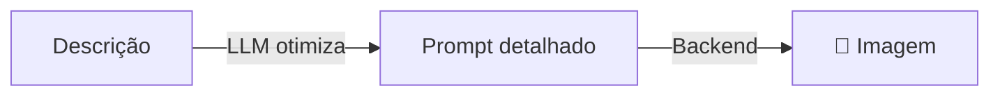

# ArtistAgent

Агент специализируется на **создании и редактировании изображений** с подсказками, оптимизированными LLM.

## Как это работает



«ArtistAgent» использует LLM для преобразования простых описаний в подробные оптимизированные подсказки перед созданием изображения.

## Использование

```python
from omniachain import ArtistAgent, OpenAI, Google

# Com DALL-E 3
artist = ArtistAgent(provider=OpenAI(), image_backend="openai")

# Com Google Nano Banana
artist = ArtistAgent(provider=Google(), image_backend="google")

# Com Stable Diffusion local
artist = ArtistAgent(provider=OpenAI(), image_backend="comfyui")
```

## Создать изображение

```python
# O LLM otimiza o prompt automaticamente
await artist.create("Logo para minha cafeteria", "logo.png")

# Sem otimização (prompt direto)
await artist.create(
    "A minimalist logo for a coffee shop, flat design, warm tones",
    "logo.png",
    optimize_prompt=False,
)
```

## Вариации

```python
paths = await artist.create_variations(
    "Retrato de gato com óculos",
    output_dir="./gatos",
    n=4,
)
# → gatos/image_1.png, image_2.png, image_3.png, image_4.png
```

## Редактировать изображения

```python
await artist.edit_image(
    "foto.png",
    "Mude o fundo para uma praia ao pôr do sol",
    output_path="foto_praia.png",
)
```

## Параметры

| Стоп | Тип | По умолчанию | Описание |
|-------|------|---------|-----------|
| `провайдер` | `Базовыйпровайдер` | — | Поставщик LLM |
| `image_backend` | `ул` | `"авто"` | Генерация серверной части |
| `инструменты` | `список[Инструмент]` | `[]` | Дополнительные инструменты |
| `system_prompt` | `ул` | — | Системная подсказка |

!!! информация «Быстрая оптимизация»
    Если optimize_prompt=True (по умолчанию), агент использует LLM для создания оптимизированных английских подсказок для серверной части, включая детали стиля, освещения, композиции и художественной техники.