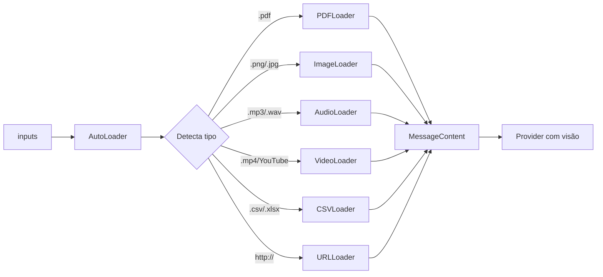

# Мультимодальный агент

Обрабатывает **любой тип ввода**: текст, PDF, изображения, аудио, видео, CSV, URL.

## Использование

```python
from omniachain import MultimodalAgent, OpenAI

agent = MultimodalAgent(provider=OpenAI("gpt-4o"))

result = await agent.run(
    "Analise todos esses dados e gere um resumo executivo",
    inputs=[
        "relatorio.pdf",           # PDF → texto extraído
        "grafico_vendas.png",      # Imagem → base64 (visão)
        "dados.csv",               # CSV → tabela + estatísticas
        "entrevista.mp3",          # Áudio → transcrição Whisper
        "apresentacao.mp4",        # Vídeo → frames + áudio
        "https://example.com",     # URL → scraping
    ],
)
```

## Как это работает внутри



## Поддерживаемые типы

| Расширение | Погрузчик | Что он делает |
|----------|-----------|-----------|
| `.pdf` | PDFLoader | Извлечение текста с помощью PyPDF |
| `.png/.jpg/.webp` | Загрузчик изображений | Base64 для собственного просмотра |
| `.mp3/.wav/.ogg` | АудиоЗагрузчик | Транскрипция с помощью Whisper |
| `.mp4/.avi/.mkv` | Видеозагрузчик | **Кадры + транскрипция** |
| `.csv/.xlsx` | CSVЗагрузчик | Панды: данные + статистика |
| `.py/.js/.ts` | КодЗагрузчик | Код с информационным синтаксисом |
| `http://...` | URL-загрузчик | Парсинг с помощью BeautifulSoup |
| URL-адрес YouTube | Видеозагрузчик | Скачать + рамки + аудио |

## Видео: 3 слоя

`VideoLoader` уникален — ни один фреймворк не делает этого:

1. **📸 Ключевые кадры**: извлекает N распределенных кадров → base64 → модель видит
2. **🎵 Аудио**: Извлечение дорожки → Шепотная транскрипция
3. **📊 Метаданные**: продолжительность, разрешение, кодек, частота кадров в секунду.

```python
from omniachain.loaders.video import VideoLoader

loader = VideoLoader(num_frames=6, transcribe_audio=True)
contents = await loader.load("video.mp4")
# → [resumo, frame1, frame2, ..., frame6, transcrição]
```

!!! предупреждение «Требование»
    VideoLoader и AudioLoader требуют установки **ffmpeg** в системе.