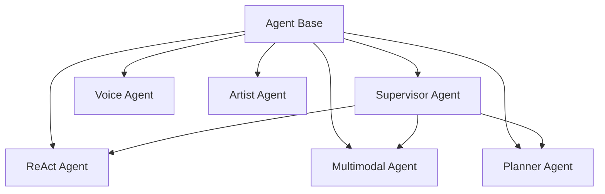

# Агенты

OmniaChain предлагает **6 типов специализированных агентов**, все с инструментальным вызовом и памятью.

## Обзор



| Агент | Специальность | Когда использовать |
|--------|--------------|-------------|
| `Агент` | Общие | Простые задачи |
| `ReActAgent` | Причина + Действие | Поиск, цепные рассуждения |
| `МультимодалАгент` | Любой ввод | PDF, изображения, аудио, видео |
| `ПланнерАгент` | План → Выполнение → Обзор | Сложные задачи по шагам |
| `СупервизорАгент` | Координаты субагентов | Мультиагент с делегированием |
| `Голосовой Агент` | STT → LLM → TTS | Голосовой чат |
| `АртистАгент` | Генерирует изображения | Создание изображений с помощью оптимизированных подсказок |

##База Агента

Самое простое средство — работает в 80% случаев:

```python
from omniachain import Agent, OpenAI, calculator, web_search

agent = Agent(
    provider=OpenAI("gpt-4o-mini"),
    tools=[calculator, web_search],
    memory="buffer",                    # Lembra conversa
    system_prompt="Responda em PT-BR.",
    max_iterations=10,                  # Máx. loops de raciocínio
)

result = await agent.run("Quanto é 15% de R$320?")
```

### Параметры

| Стоп | Тип | Описание |
|-------|------|-----------|
| `провайдер` | `Базовыйпровайдер` | Поставщик искусственного интеллекта |
| `инструменты` | `список[Инструмент]` | Доступные инструменты |
| `память` | `ул \| Память` | `"буфер"`, `"сводка"` или экземпляр |
| `system_prompt` | `ул` | Системная подсказка |
| `max_iterations` | `интервал` | Макс. циклы вызова инструмента |
| `пара ключей` | `Пара ключей` | Ключ PGP агента |
| `разрешения` | `Разрешения` | Правила доступа |

---

!!! наберите «Далее»
    См. специализированные агенты: [ReAct](react.md) · [Мультимодальный](multimodal.md) · [Планировщик](planner.md) · [Супервизор](supervisor.md) · [Голос](voice.md) · [Исполнитель](artist.md)