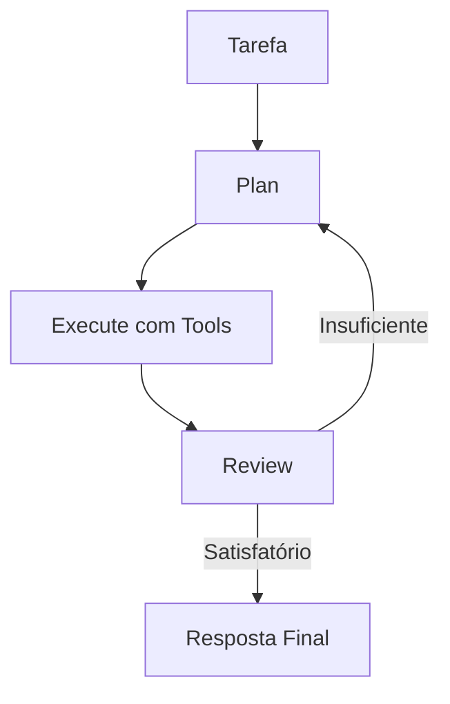

# ПланировщикАгент

Следуйте циклу **План → Выполнение → Обзор** для сложных задач.

## Использование

```python
from omniachain import PlannerAgent, Anthropic, web_search, file_write

agent = PlannerAgent(
    provider=Anthropic(),
    tools=[web_search, file_write],
)

result = await agent.run("Crie um relatório sobre tendências de IA em 2025")
print(result.metadata["plan"])    # O plano criado
print(result.metadata["review"])  # A revisão do resultado
```

## Цикл выполнения



1. **План**: LLM создает подробный план с пронумерованными шагами.
2. **Выполнить**: запустить BaseAgent с инструментами для каждого шага.
3. **Обзор**: LLM оценивает, соответствует ли результат цели.

## Когда использовать

- ✅ Длинные отчеты и опросы
- ✅ Задачи с несколькими зависимыми шагами
- ✅Когда качество результата важнее скорости
- ❌ Простые вопросы (используйте «Агент»)