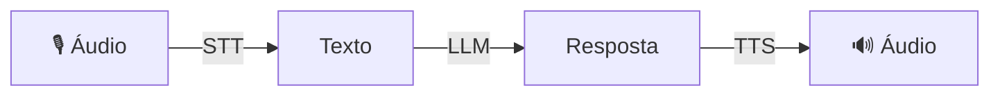

# Голосовой агент

Агент, который общается посредством голосового чата — **STT → LLM → TTS** в автоматизированном конвейере.

## Как это работает



## Использование

```python
from omniachain import VoiceAgent, OpenAI, Groq

# Configuração básica
agent = VoiceAgent(provider=OpenAI())

# Configuração completa
agent = VoiceAgent(
    provider=Groq(),
    stt_backend="whisper-local",      # STT local
    tts_backend="edge",               # TTS gratuito
    tts_voice="pt-BR-AntonioNeural",  # Voz pt-BR
    language="pt",
    system_prompt="Responda de forma curta e direta.",
)
```

## Обработка звука

```python
# Áudio de entrada → áudio de resposta
audio_resposta = await agent.listen_and_respond("pergunta.mp3")

# Salvar resposta em arquivo
audio = await agent.listen_and_respond(
    "pergunta.mp3",
    output_path="resposta.mp3",
)

# Apenas texto (sem TTS)
texto = await agent.listen_and_respond_text("pergunta.mp3")
```

## Интерактивный чат

Терминальный режим, в котором пользователь вводит, а агент отвечает:

```python
await agent.chat()
```

```
🎙️ VoiceAgent — Modo Interativo

Você: Qual a capital do Brasil?
🤖 Agente: A capital do Brasil é Brasília.

Você: ^C
Conversa encerrada.
```

## Параметры

| Стоп | Тип | По умолчанию | Описание |
|-------|------|---------|-----------|
| `провайдер` | `Базовыйпровайдер` | — | Поставщик искусственного интеллекта (LLM) |
| `инструменты` | `список[Инструмент]` | `[]` | Доступные инструменты |
| `stt_backend` | `ул` | `"авто"` | Серверная часть STT |
| `tts_backend` | `ул` | `"авто"` | Серверная часть TTS |
| `tts_voice` | `ул` | `Нет` | Голос для ТТС |
| `язык` | `ул` | `"ПТ"` | Язык |
| `system_prompt` | `ул` | — | Системная подсказка |

!!! совет «Совет»
    Используйте `stt_backend="whisper-local"` + `tts_backend="edge"` для 100% свободного агента (кроме LLM).