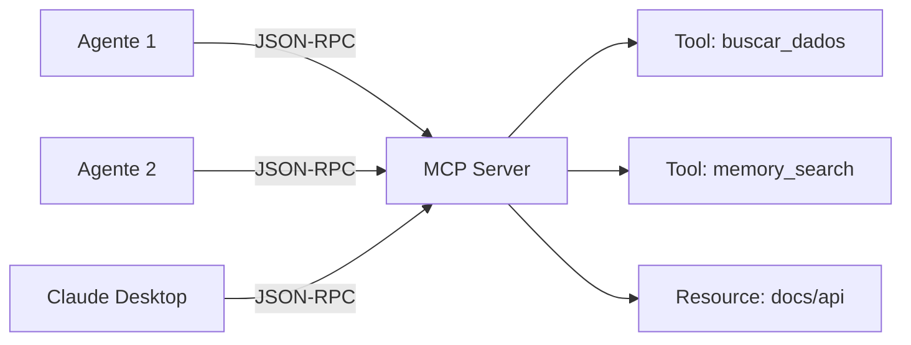

# MCP — Протокол контекста модели

OmniaChain имеет **встроенную** поддержку Anthropic MCP — сервера, клиента и транспорта.

## Что такое MCP?

MCP — это стандартизированный протокол для предоставления инструментов, ресурсов и подсказок через JSON-RPC. Разрешает **любому агенту** доступ к инструментам с **любого сервера**.

## Когда использовать

| Сценарий | Решение |
|---------|---------|
| Инструменты в одном процессе | декоратор `@tool` |
| Инструменты, общие для агентов | **MCP-сервер** |
| Свяжитесь с Клодом Desktop | **Сервер MCP (stdio)** |
| Доступ к инструментам внешнего сервера | **Клиент MCP** |

!!! наберите «Далее»
    - [Создать MCP-сервер](server.md)
    - [Использовать MCP-клиент](client.md)