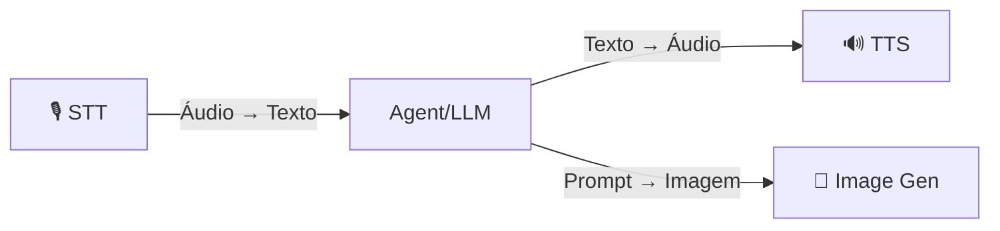

# Медиа: STT, TTS и изображения.

OmniaChain предлагает **3 медиасервиса** с подключаемыми серверными модулями — платные API и 100 % бесплатные/локальные альтернативы.

## Обзор



| Сервис | Класс | Встроенные серверные части |
|---------|--------|-------------------|
| **Преобразование речи в текст** | `РечьToText` | `openai`, `whisper-local`, `faster-whisper`, `google` |
| **Преобразование текста в речь** | `TextToSpeech` | `openai`, `edge` ⭐, `coqui`, `google` |
| **Генерация изображений** | `Генератор изображений` | `openai`, `google`/`nano-banana`, `стабильность`, `comfyui` |

!!! совет «Бесплатно»
    - **Edge TTS** — бесплатный TTS от Microsoft, без ключа API, высококачественные голоса PT-BR.
    - **Локальный шепот** — STT работает на 100 % в автономном режиме.
    - **ComfyUI** — Локальное стабильное распространение, бесплатно.

## Быстрый старт

```python
from omniachain import SpeechToText, TextToSpeech, ImageGenerator

# STT — Transcrever áudio
stt = SpeechToText(backend="auto")
texto = await stt.transcribe("audio.mp3")

# TTS — Sintetizar voz (Edge TTS = grátis)
tts = TextToSpeech(backend="edge", voice="pt-BR-AntonioNeural")
await tts.speak_to_file("Olá mundo!", "saida.mp3")

# Gerar Imagem (DALL-E, Nano Banana, etc.)
gen = ImageGenerator(backend="openai")
await gen.generate_to_file("Um gato astronauta", "gato.png")
```

## Пользовательский бэкэнд

Подключите **любой API** в 3 строки:

```python
from omniachain.media.image_gen import ImageBackend, ImageGenerator

class MidjourneyBackend(ImageBackend):
    async def generate(self, prompt, size="1024x1024", n=1, **kw):
        # chamar sua API aqui
        return [image_bytes]

ImageGenerator.register_backend("midjourney", MidjourneyBackend)
gen = ImageGenerator(backend="midjourney")
```

Тот же шаблон работает для STTBackend и TTSBackend.

## Специализированные агенты

| Агент | Класс | Что он делает |
|--------|--------|-----------|
| **Голосовой агент** | `Голосовой Агент` | STT → LLM → TTS (голосовой чат) |
| **Агент Артиста** | `АртистАгент` | Генерирует изображения с помощью подсказок, оптимизированных для LLM |

```python
from omniachain import VoiceAgent, ArtistAgent, OpenAI

# Agente de voz
voice = VoiceAgent(provider=OpenAI(), tts_backend="edge")
audio = await voice.listen_and_respond("pergunta.mp3")
await voice.chat()  # Modo interativo no terminal

# Agente artista
artist = ArtistAgent(provider=OpenAI(), image_backend="openai")
await artist.create("Logo para café minimalista", "logo.png")
```

##Инструменты

Любой агент может использовать медиа-инструменты:

```python
from omniachain import Agent, Groq, speech_to_text, text_to_speech, generate_image

agent = Agent(
    provider=Groq(),
    tools=[speech_to_text, text_to_speech, generate_image],
)

result = await agent.run("Transcreva o arquivo audio.mp3 e depois leia o texto em voz alta")
```

---

!!! информация «Далее»
    Подробности о каждой услуге см.: [STT](stt.md) · [TTS](tts.md) · [Генерация изображения](image-gen.md)