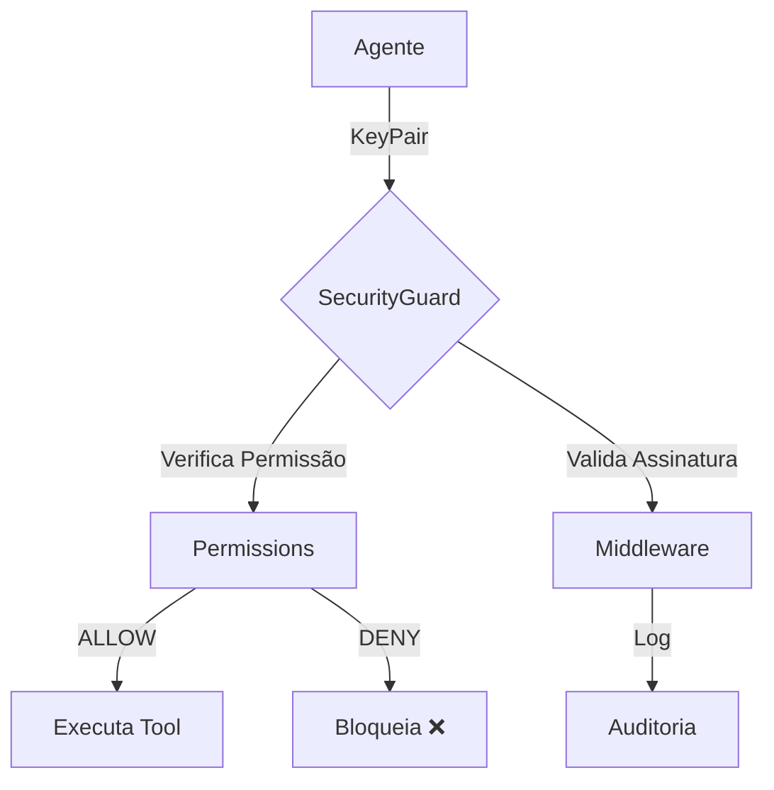

# PGP-безопасность

OmniaChain реализует контроль доступа с помощью **ключей PGP** — каждый агент имеет криптографическую идентификацию.

## Архитектура



## 1. Генерация ключей

```python
from omniachain import KeyPair

keys = await KeyPair.generate(agent_name="admin")
print(keys.fingerprint)   # "a1b2c3d4e5f6..."
print(keys.public_key)    # Chave pública
print(keys.private_key)   # Chave privada
```

!!! информация «GPG против HMAC»
    Если установлен `python-gnupg`, он использует **настоящий GPG**. В противном случае используйте **HMAC-SHA256** в качестве безопасного варианта.

## 2. Настройте разрешения

```python
from omniachain import Permissions

perms = Permissions()

# Admin acessa tudo
perms.grant(admin_keys.fingerprint, all_resources=True)

# Analyst só pode usar calculator e web_search
perms.grant(analyst_keys.fingerprint, tools=["calculator", "web_search"])
perms.deny(analyst_keys.fingerprint, tools=["code_exec", "file_write"])

# Verificar
perms.can_access(analyst_keys.fingerprint, "tool", "calculator")   # True
perms.can_access(analyst_keys.fingerprint, "tool", "code_exec")    # False
```

### Правила доступа

| Метод | Эффект |
|--------|--------|
| `grant(fp, инструменты=[...])` | Позволяет использовать определенные инструменты |
| `grant(fp, Memory=[...])` | Позволяет операции с памятью |
| `грант(fp, all_resources=True)` | Разрешает **все** |
| `deny(fp,tools=[...])` | Блокирует инструменты (приоритет!) |

!!! предупреждение «ЗАПРЕТИТЬ > РАЗРЕШИТЬ»
    Правила `deny` **всегда** имеют приоритет над `grant`.

## 3. Агент с охраной

```python
agent = Agent(
    provider=OpenAI(),
    tools=[calculator, web_search, code_exec],
    keypair=analyst_keys,
    permissions=perms,
)

# O agente SÓ pode usar calculator e web_search
# Se tentar code_exec → "Acesso negado"
```

## 4. Промежуточное ПО (API)

Чтобы проверить внешние запросы:

```python
from omniachain.security.middleware import SecurityMiddleware

middleware = SecurityMiddleware(permissions=perms)

# Valida: assinatura + permissão + timestamp
req = await middleware.validate_request(
    keypair=agent_keys,
    resource_type="tool",
    resource_name="web_search",
)

# Log de auditoria
for entry in middleware.get_audit_log():
    print(f"[{entry['decision']}] {entry['agent']} → {entry['resource']}")
```